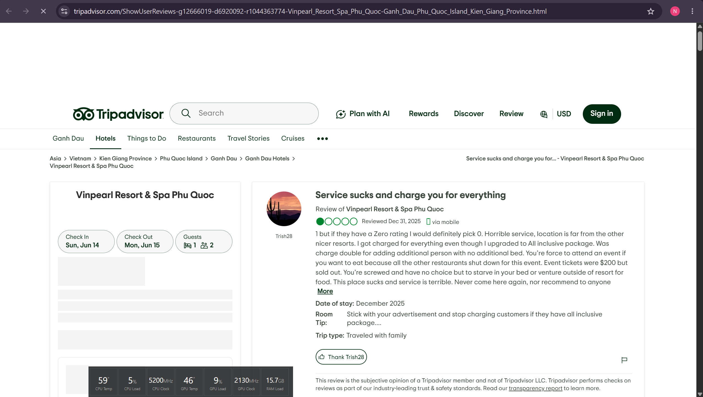
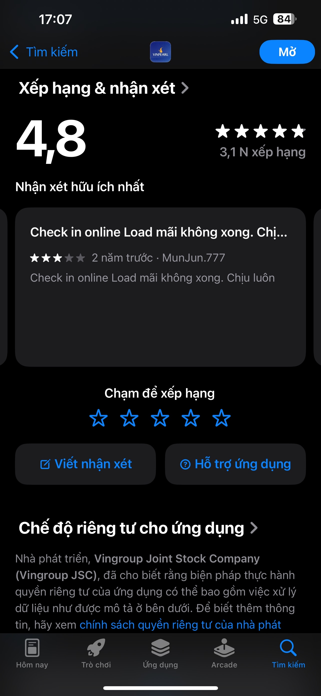
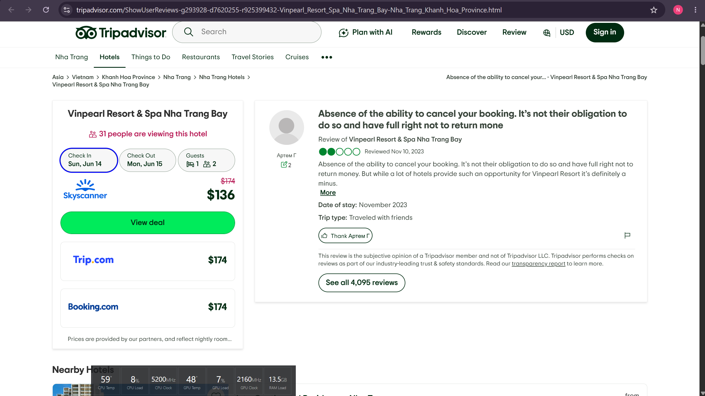
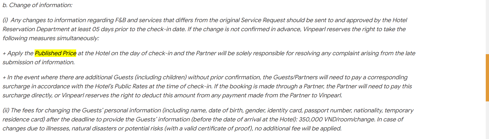
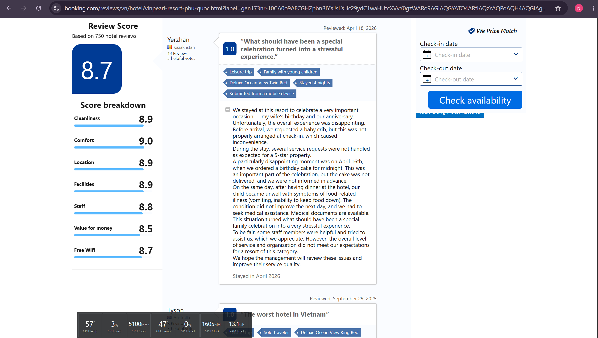
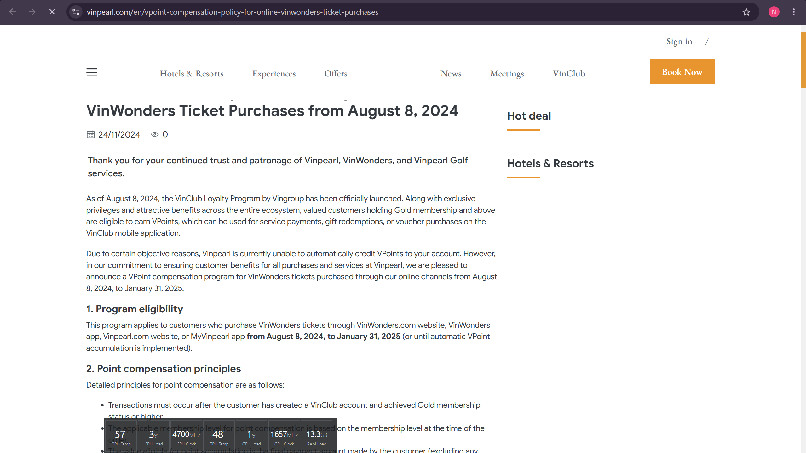
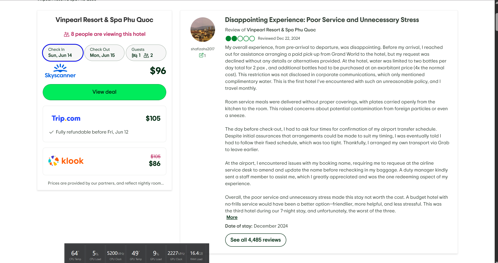

# Evidence Pack — MyVinpearl / Vinpearl Booking

## 1. Nhóm và track

**Tên nhóm:** 
**Track:** Travel & Hospitality
**Product/app đã chọn:** MyVinpearl / Vinpearl booking (app + `vinpearl.com`, `booking.vinpearl.com`)
**Build slice đang nghĩ:** AI hỏi 3-4 câu về nhu cầu chuyến đi → gợi ý 2-3 gói nghỉ dưỡng kèm lý do, quyền lợi chính, điều kiện cần lưu ý (Augmentation).

## 2. Self-use evidence

| Observation | Screenshot/link | Path liên quan | Điều học được |
|---|---|---|---|
| Form booking chỉ hỏi điểm đến/ngày/phòng/khách, không hỏi mục đích chuyến đi, ngân sách, nhóm đi cùng, sở thích | `evidence/self-e1.png` | Low-confidence | Hệ thống giả định user đã biết rõ mình muốn gì; user mơ hồ không được dẫn dắt |
| Nhiều ưu đãi/combo/voucher hiển thị cùng lúc, mỗi gói có điều kiện & quyền lợi riêng | `evidence/self-e1.png`, `evidence/self-e2.png` | Low-confidence | Decision fatigue — user phải tự đọc & tự so sánh nhiều gói |
| Khó nhận ra điểm khác biệt dẫn đến chênh lệch giá giữa các gói/phòng | `evidence/self-e3.png` | Low-confidence / Failure | User không hiểu vì sao gói A đắt hơn gói B → mất niềm tin, phân vân |
| Đã thử scenario "gia đình/couple đi Phú Quốc / Nha Trang" trong luồng tìm kiếm | `evidence/self-e4.png` | Low-confidence | Không có flow hỏi lại tiêu chí; user tự gánh việc lọc |

| Self-use evidence 1 — Form booking | Self-use evidence 2 — Ưu đãi/combo | Self-use evidence 3 — Chênh lệch giá |
|---|---|---|
|  |  |  |

| Self-use evidence 4 — Scenario tìm kiếm |
|---|
|  |

## 3. User / review / social evidence

| # | Quote / review / observation | Nguồn | User là ai? | Pain/failure mode |
|---|---|---|---|---|
| **E2** ✅ | "Check in online Load mãi không xong. Chịu luôn" — **MunJun.777, 3/5★, ~2 năm trước** (app tổng 4,8★ / 3,1N lượt) | **Screenshot thật:** `evidence/e2-appstore.png` — App Store iOS ([listing](https://apps.apple.com/vn/app/myvinpearl/id1484921109)) | Khách đã đặt, đang check-in online trước khi đến | Failure: online check-in lỗi → vẫn phải chờ ở quầy |
| **E1** ✅ (thay quote cũ) | "I got charged for everything even though I upgraded to All inclusive package. Was charge double for adding additional person with no additional bed." — **Trish28, 1/5★, lưu trú 12/2025** | Tripadvisor ([review](https://www.tripadvisor.com/ShowUserReviews-g12666019-d6920092-r1044363774-Vinpearl_Resort_Spa_Phu_Quoc-Ganh_Dau_Phu_Quoc_Island_Kien_Giang_Province.html)) | Khách mua gói "All inclusive" | Trust/decision: **quyền lợi gói không rõ** → tưởng đã gồm nhưng vẫn bị tính phí |
| **E7** ✅ | "Poor service and unnecessary stress made this stay not worth the cost." (kèm: yêu cầu đưa đón sân bay bị từ chối, phải xác nhận 4 lần, lỗi tên booking ở sân bay phải xếp hàng lại) — **shafizahs2017, 2/5★, 22/12/2024** | Tripadvisor ([review](https://www.tripadvisor.com/ShowUserReviews-g12666019-d6920092-r985654791-Vinpearl_Resort_Spa_Phu_Quoc-Ganh_Dau_Phu_Quoc_Island_Kien_Giang_Province.html)) | Khách đã đặt, đi thường xuyên | Failure/recovery: thông tin booking & dịch vụ không khớp, không có phương án thay thế |
| E3 | "Absence of the ability to cancel your booking. It's not their obligation to do so and have full right not to return money" — 2/5★ | Tripadvisor, reviewer Артем Г, 10/11/2023 ([review](https://www.tripadvisor.com/ShowUserReviews-g293928-d7620255-r925399432-Vinpearl_Resort_Spa_Nha_Trang_Bay-Nha_Trang_Khanh_Hoa_Province.html)) | Khách đặt rồi muốn đổi/hủy | Trust/recovery: chính sách hủy không rõ trước khi đặt → mất tiền, mất niềm tin |
| E4 | Dịch vụ **ngoài Room Package** bị tính thêm; nếu khách không xác nhận thông tin đúng hạn, Vinpearl có quyền **áp "Published Price" ngày check-in thay vì giá voucher/giảm giá**. *(Mô tả theo điều khoản; chưa fetch lại được vì trang 403 — chụp đúng đoạn bạn thấy trên trang, đừng tìm cứng cụm "Static/Package Rate".)* | Vinpearl — [Reservations Regulations](https://vinpearl.com/en/reservations-regulations) | Khách so sánh giá/gói/voucher | Low-confidence: không rõ gói gồm gì & vì sao giá đổi |
| E5 | Review Booking.com phản ánh bữa ăn/dịch vụ thêm tại resort bị cho là đắt; quyền lợi gói không rõ trước khi đặt *(mô tả tổng hợp — chưa trích review cụ thể; mở link chọn 1 review điểm thấp để chụp)* | [Booking.com — Vinpearl Resort & Spa Phú Quốc reviews](https://www.booking.com/reviews/vn/hotel/vinpearl-resort-phu-quoc.html) | Khách đã ở, đánh giá value | Trust/value: kỳ vọng quyền lợi gói ≠ thực tế |
| E6 | Vinpearl thừa nhận không tự cộng được VPoints, phải chạy chương trình "đền bù VPoint" cho giao dịch 8/8/2024–31/1/2025 *(mô tả theo thông báo — mở link xác nhận khi nộp)* | Vinpearl — [VPoint compensation notice](https://vinpearl.com/en/vpoint-compensation-policy-for-online-vinwonders-ticket-purchases) | Khách dùng ưu đãi/điểm thưởng | Failure: hệ thống ưu đãi/điểm không đáng tin → cần recovery |


| E1 — Tripadvisor (Trish28) | E2 — App Store (đã có ảnh thật) | E3 — Tripadvisor (Артем Г) |
|---|---|---|
|  |  |  |

| E4 — Rate rules | E5 — Booking.com | E6 — VPoint |
|---|---|---|
|  |  |  |

| E7 — Tripadvisor (shafizahs2017) |
|---|
|  |

## 4. Competitor / analog evidence

| App / mô hình tham khảo | Họ xử lý task này thế nào? | Pattern học được | Có áp dụng trong 1 ngày không? |
|---|---|---|---|
| Booking.com / Agoda | Filter mạnh + gợi ý "phù hợp với bạn", sort theo nhu cầu | Hỏi tiêu chí trước → thu hẹp lựa chọn | Có — bắt chước phần hỏi tiêu chí |
| Hopper / trip planner AI | Hỏi vài câu rồi đề xuất chuyến đi + giải thích giá | Conversational intake → gợi ý có lý do | Có — đây là lõi build slice |
| Airbnb / Klook | Gợi ý combo trải nghiệm theo nhóm đi (gia đình, couple) | Gắn gói với "ai đi cùng" | Một phần |

## 5. Evidence -> Insight

```text
Evidence nổi bật nhất:
- Self-use: form chỉ hỏi điểm đến/ngày/phòng/khách, không hỏi mục đích/ngân sách/nhóm đi.
- Review E2 (có screenshot thật): "Check in online Load mãi không xong. Chịu luôn" — MunJun.777, 3★.
- **E1 (Trish28, 1★, 12/2025)**: mua gói "All inclusive" nhưng vẫn bị tính phí mọi thứ → bằng chứng đắt giá rằng **quyền lợi gói không rõ**, đúng pain chính.
- E4: dịch vụ ngoài Room Package bị tính thêm + áp "Published Price" nếu không xác nhận đúng hạn → user không rõ gói gồm gì & vì sao giá đổi.
- E3/E5/E6/E7: chính sách hủy, value gói, điểm thưởng, đưa đón/tên booking không rõ trước khi đặt → mất niềm tin (trust/recovery).

Insight:
User không chỉ gặp problem "giao diện nhiều lựa chọn / app lỗi".
Thật ra họ cần hỗ trợ ra quyết định: biết gói nào hợp nhu cầu thật của mình
và tin được vì sao gói đó đáng chọn (quyền lợi, giá, điều kiện).

Opportunity:
AI có thể augment bằng cách hỏi nhanh 3-4 câu (đi với ai, ngân sách, mục đích, ràng buộc)
rồi gợi ý 2-3 gói phù hợp kèm lý do — thu hẹp quyết định thay vì bắt user tự đọc tất cả.
```

## 6. Evidence đổi SPEC như thế nào?

- [x] Đổi pain statement.
- [x] Đổi build slice.
- [x] Đổi Auto/Aug decision.

```text
Trước evidence, nhóm định "làm app booking đẹp hơn / sửa UI".
Sau evidence, nhóm đổi thành "build slice AI hỏi nhu cầu → gợi ý gói có lý do",
vì pain thật là decision support + trust, không phải thẩm mỹ UI.
Lý do: cả self-use lẫn review đều chỉ về việc user không biết chọn gì và không tin được lựa chọn.
```
